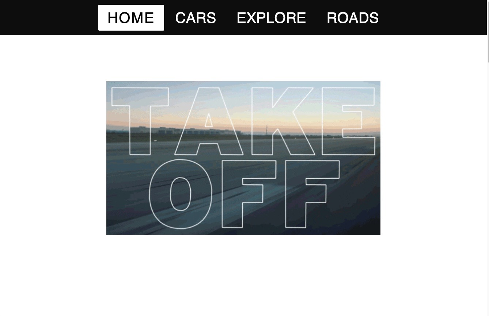

# Cruise-North-America

Technologies Used: HTML, CSS, JavaScript, EJS, Express, mongoDB, Mongo Atlas, Railway.

Approach Taken: After setting up the file structure, I focused on building the website with a mobile first approach. Once the website was optimized for mobile devices, I then focused on optimizing the website for larger resolutions. 

Unresolved Problems: Optimizing loading times for CSS animations. 

User Stories: 

As A Software Engineer, I would like to create a website where I can demonstrate my ability to develop a full stack application, all while being able to share my code in order to improve

As a Software Engineer, I want every recruiter to have the ability to view my website in order to showcase my skills and ability to code. 

As a Software Engineer with a passion for cars, I would like to create a website where other Car enthusiast can post pictures of their vehicles, as well being able to find new roads to drive on. 

As a Software Engineer with experience creating a full stack application, Users will be able to create, post, update, and delete posts of cars and roads of their interest. 
 
As a car enthusiast myself, other car enthusiast will have the ability to share their thoughts regarding a particular vehicle, which has the potential to help buyers and car enthusiast to decide which car they should buy next.

Wireframe: https://wireframepro.mockflow.com/view/MIOGTy270ob#/page/6719abf1ad2d4935ba1840ca7cdf0340

Link to website: https://cruise-north-america-production.up.railway.app/
